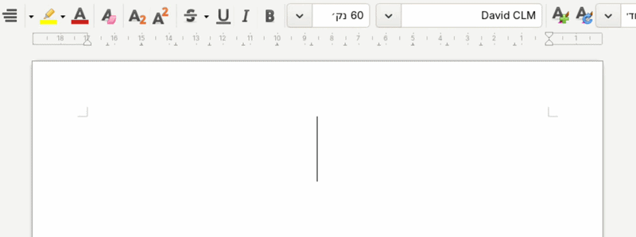

# GNOME Behafucha
GNOME Shell extension for instantly converting text typed in the wrong keyboard layout (Hebrew/English).

## Overview
This extension converts text typed in the wrong layout (e.g., converting `akuo` to `שלום`). 

**To use:** Simply select the text and press `<Super>z`

<p align="center">
  
</p>

## Installation

### From GNOME Shell extensions site
Install from [GNOME Shell extensions site](https://extensions.gnome.org/extension/9879/gnome-behafucha/).

### Manual Installation
1. Download the [source code](https://github.com/amiad/gnome-behafucha/archive/refs/heads/master.zip).
2. Ensure the directory is named `gnome-behafucha@hatul.info`.
3. Move the directory to `~/.local/share/gnome-shell/extensions/`.
4. **Compile schemas:**
```bash
glib-compile-schemas ~/.local/share/gnome-shell/extensions/gnome-behafucha@hatul.info/schemas/
```

## Settings & Configuration
The default shortcut is **`<Super>z`**.

### Changing the Shortcut via GUI
1. Open the **Extensions** or **Extension Manager** app.
2. Locate **GNOME Behafucha** in the list.
3. Click the **Settings** (gear icon) button to open the configuration window and enter your new key combination.

### Changing the Shortcut via Terminal
If you prefer the command line, run:
```bash
gsettings set org.gnome.shell.extensions.gnome-behafucha convert-text-shortcut "['<Super>b']"
```

## Troubleshooting
* **Settings window won't open:** Ensure you have compiled the schemas as shown in the manual installation section.
* **Shortcut conflict:** If the shortcut doesn't trigger, make sure it isn't already assigned to another GNOME action.
* **Shift Key Issues:** Avoid using the `Shift` key as a modifier for your shortcut (e.g., `<Super><Shift>z`). Using `Shift` can interfere with the automated selection and copy-paste simulation, causing the conversion to fail.
* **Clipboard Content:** This extension is optimized for text. To ensure system stability, non-text data (such as images) currently in the clipboard may be lost during the conversion process.

## Privacy
This extension is designed with privacy in mind:
* **Local Processing:** All text conversion is performed locally on your machine.
* **Clipboard Access:** The extension only accesses the clipboard when the conversion shortcut is explicitly triggered by the user.
* **No Data Collection:** No text, metadata, or usage statistics are stored, logged, or transmitted to any external servers or third parties.

## License
GPLv3
